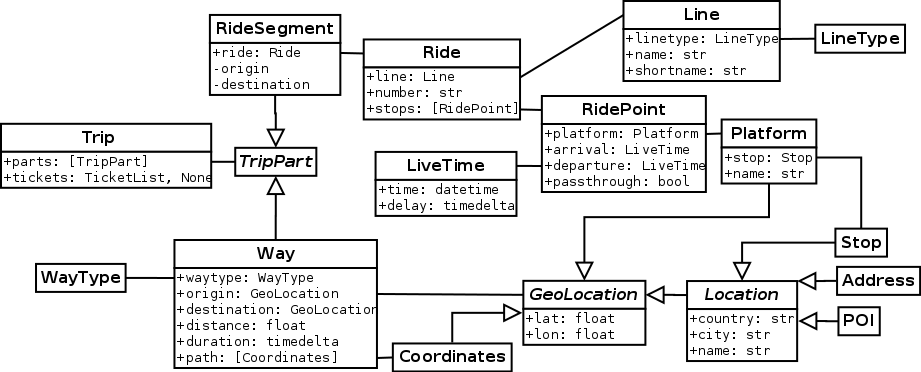

# choo  

choo is a uniform interface for public transport APIs written in Python 3. A JSON interface is available via command line and HTTP to use it with other languages.

## Installation

You can install choo from the [Python Package Index](https://pypi.python.org/pypi/choo).

*Please note that this project is released with a [Code of Conduct](CODE_OF_CONDUCT.md) that applies to all project-related communication. By participating in this project you agree to abide by its terms.*
